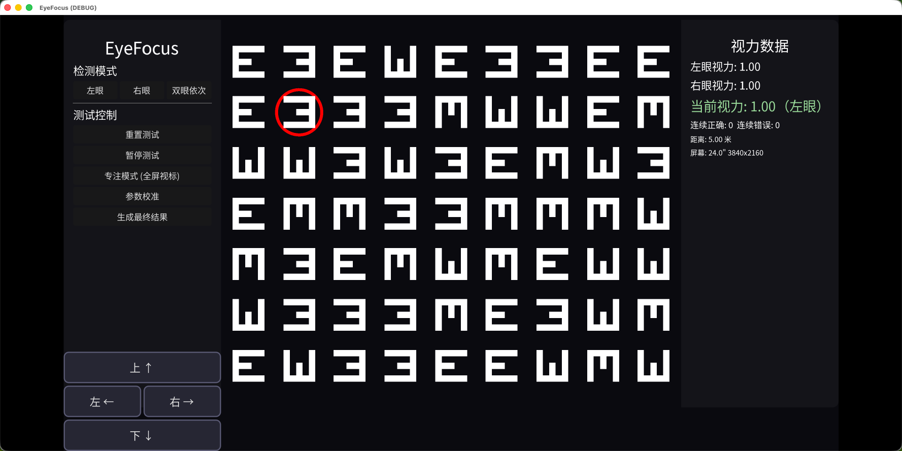

# EyeFocus — 专业视力自测工具

基于 **Godot Engine 4.6** 开发的专业视力自测应用，实现医院标准对数视力表（E字视标）的数字化模拟，可在电脑屏幕上进行精确的视力测量。

## 功能特性

- **标准对数视力表**：严格遵循国家标准对数视力表，视力等级从 0.10 到 2.0 共 14 级
- **双/单眼模式**：支持左眼、右眼单独测试，以及双眼依次测试
- **物理精确计算**：根据显示器尺寸、分辨率、测试距离计算视标实际像素大小，确保结果准确
- **自适应网格布局**：视标网格根据容器尺寸动态排列，智能计算行列数和间距
- **专注模式**：隐藏所有UI面板，全屏显示视标，同时隐藏鼠标光标，减少干扰
- **方向答题**：通过屏幕按钮或键盘快捷键（WASD / 方向键）选择 E 字朝向
- **自适应阶梯算法**：连续答对 3 次升级、答错 2 次降级，模拟真实视力测试流程
- **双目独立记录**：左右眼视力数据分别存储，独立追踪测试进度
- **参数校准**：支持自定义输入显示器尺寸、分辨率、测试距离

## 游戏截图



## 安装与运行

### 系统要求

- **Godot Engine 4.6+**（推荐使用 Mono 版本）
- 任意支持 Godot 4 的操作系统（Windows / macOS / Linux）

### 运行方式

1. 克隆或下载本项目到本地
2. 使用 Godot 4.6 打开项目根目录的 `project.godot` 文件
3. 点击编辑器右上角的「运行」按钮（或按 F5）

### 导出发布

在 Godot 编辑器中选择「项目 > 导出」，根据目标平台配置导出模板即可生成独立可执行文件。

## 使用方法

### 基础流程

1. 启动应用后，在左侧面板选择检测模式（左眼/右眼/双眼依次）
2. 根据提示遮挡相应眼睛
3. 观察中央区域的 E 字视标，判断其开口方向
4. 点击底部方向按钮或使用键盘快捷键（W/A/S/D 或 ↑/↓/←/→）作答
5. 系统自动根据答题情况调整视力等级
6. 测试完成后点击「生成最终结果」查看视力数据

### 按键操作

| 按键          | 功能         |
| ------------- | ------------ |
| **W** / **↑** | 选择「上」   |
| **S** / **↓** | 选择「下」   |
| **A** / **←** | 选择「左」   |
| **D** / **→** | 选择「右」   |
| **ESC**       | 退出专注模式 |

### 模式说明

- **左眼模式**：仅测试左眼，请遮挡右眼
- **右眼模式**：仅测试右眼，请遮挡左眼
- **双眼依次模式**：先测左眼，再测右眼，依次记录双眼数据

### 参数校准

在测试前建议进行参数校准，以确保视力结果的准确性：

1. 点击「参数校准」按钮
2. 输入显示器对角线尺寸（英寸）
3. 输入屏幕分辨率（宽 × 高）
4. 输入测试距离（米，建议 5 米）
5. 点击「确认并校准视标」

> **提示**：默认值为 24 英寸 1920×1080 显示器、5 米测试距离。如果使用笔记本电脑或小尺寸显示器，请务必校准以获得准确结果。

### 专注模式

点击「专注模式」按钮可隐藏左右两侧面板和底部按钮栏，全屏仅显示视标网格，同时鼠标光标自动隐藏，适合在较远距离进行测试。按 ESC 键退出专注模式。

## 项目架构

```
eye-focus/
├── project.godot                # 项目配置文件
├── icon.svg                     # 应用图标
├── font/
│   └── SourceHanSansSC-Regular-2.otf  # 思源黑体字体
├── scenes/
│   └── main.tscn                # 主场景（UI布局）
└── scripts/
    ├── Main.gd                  # 主控制器（UI协调、事件处理）
    ├── EyeChart.gd              # E字视标渲染（_draw绘制）
    ├── OptotypeContainer.gd     # 视标网格容器（布局、呼吸动画）
    ├── TestController.gd        # 测试流程控制器（答题验证、刷新）
    ├── VisionCalculator.gd      # 视力值→像素大小计算
    ├── VisionLevelManager.gd    # 视力等级状态管理
    └── CalibrationPanel.gd      # 校准面板占位脚本
```

### 核心模块说明

#### VisionCalculator（视力计算器）

基于标准对数视力表的数学公式：

```
1 分角 = 1/60 度
笔画宽 (mm) = tan(1 分角 / 视力值) × 测试距离 (mm)
视标边长 (mm) = 5 × 笔画宽
视标边长 (px) = 视标边长 (mm) × 像素密度 (px/mm)
```

首先根据屏幕对角线尺寸和分辨率计算像素密度（px/mm），然后根据视力值和测试距离计算视标在屏幕上的实际像素大小。

#### VisionLevelManager（视力等级管理器）

维护标准对数视力表的 14 个等级：
0.10 → 0.12 → 0.15 → 0.20 → 0.25 → 0.30 → 0.40 → 0.50 → 0.60 → 0.80 → 1.00 → 1.20 → 1.50 → 2.00

采用自适应阶梯算法：
- **连续答对 3 次** → 升级（视力值增大，视标变小）
- **答错 2 次** → 降级（视力值减小，视标变大）
- 左右眼数据独立存储和追踪

#### EyeChart（E字视标）

使用 Godot 的 `_draw()` 方法直接绘制 E 字形状，由四个矩形组成：
- 左侧竖笔画（贯穿高度）
- 上、中、下横笔画
- 通过 `draw_set_transform` 旋转实现四个方向（上/下/左/右）

#### OptotypeContainer（视标网格）

核心布局算法：
1. 根据容器尺寸和视标大小计算理论最大行列数
2. 从大往小尝试，找到能完美容纳的网格配置
3. 动态计算间距使网格居中
4. 随机分配方向，随机选取一个作为目标视标
5. 使用红色呼吸动画圆环标记目标视标

## 技术细节

- **引擎版本**：Godot 4.6
- **渲染器**：GL Compatibility（兼容模式）
- **分辨率**：1280×720（横屏）
- **拉伸模式**：canvas_items（自适应缩放）
- **UI框架**：Control 节点 + Container 布局
- **物理引擎**：Jolt Physics（已启用但未使用）

## 许可证

本项目仅供学习和个人使用。如需商用请咨询作者。

---

*项目名称：EyeFocus —— 让视力自测更专业*